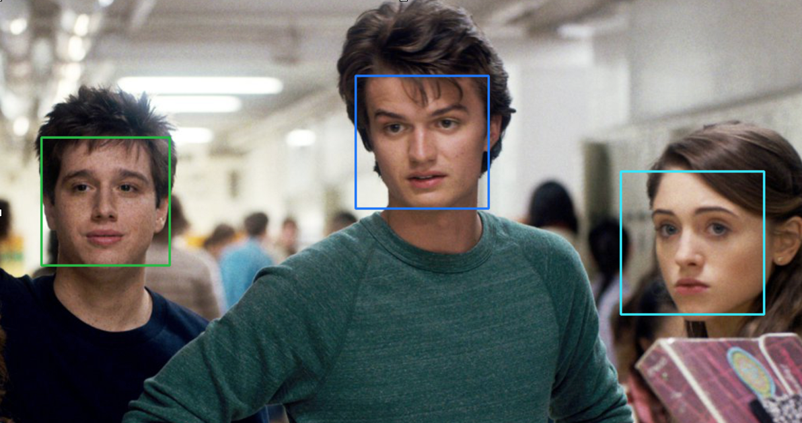
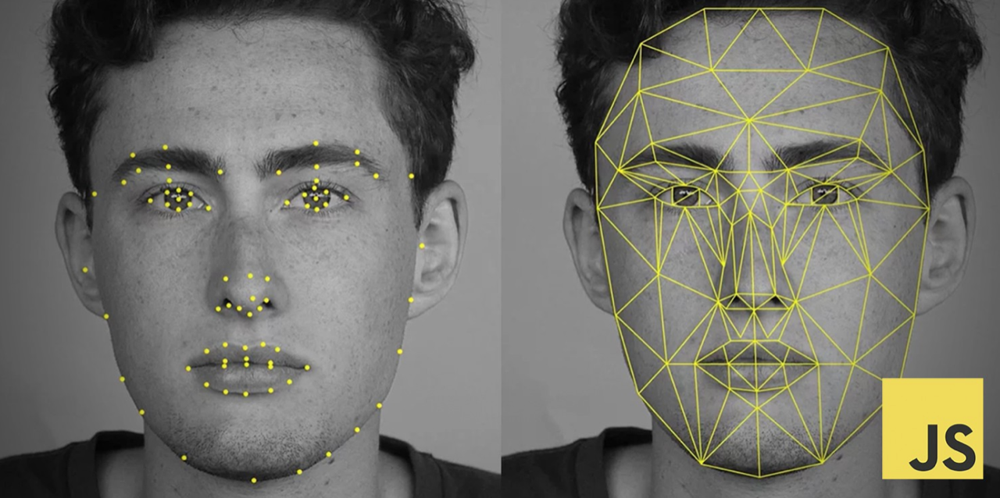
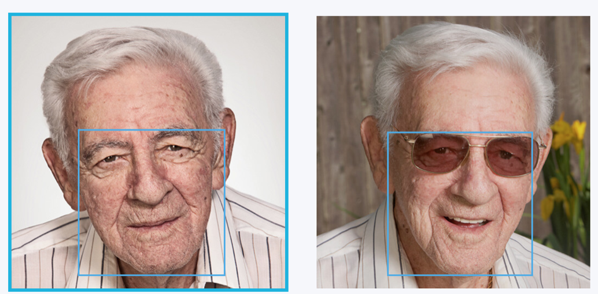
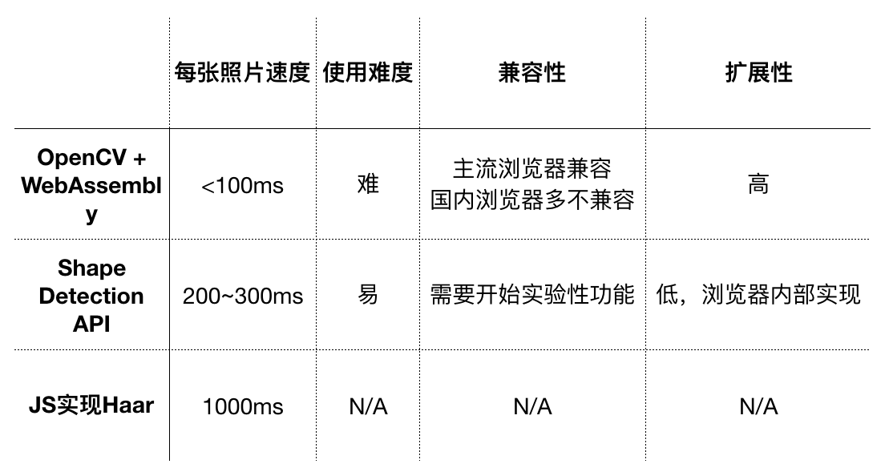

前端人脸识别
===
version: 0.1

项目使用方式：

cd 到项目路径

http-server或者其他方式起一个本地服务器，访问index.html，等待几秒钟

##  人脸识别过程

人脸识别可分为以下四个部分：

1. 人脸检测（detection）：给定任意一张图片，找到其中是否存在一个或多个人脸，并返回图片中每个人脸的位置和范围。

2. 人脸校准（alignment）：给定一张脸，找出其中特征点的位置，如鼻子左侧、瞳孔位置、上嘴唇下嘴唇等，经过校准得到特征点位置后，再经过位置驱动的变形，就可以将人脸摆正

3. 人脸比对（verification）：给定两张脸，判断是否为同一人。常用于登录控制、身份确认等，如基于人脸的手机解锁

4. 人脸识别（identification）：给定一张脸和一个人脸数据库，判断给定的脸是哪个人

除了人脸识别需要数据库所以必须由后端实现外，其余三种过程都可以尝试在前端实现。

并且人脸检测放在前端可以先行截取人脸区域，减少带宽的使用。

## 人脸检测在前端的实现方案

1. JS实现的第三方库，如Tracking.js
2. OpenCV + WebAssembly
3. Shape Detection API

[OpenCV](https://opencv.org/)是一个计算机视觉库，使用C++编写，另外提供了Java、Python等语言的接口。通过WebAssembly技术，我们可以将其转义成浏览器可用的wasm文件。

[Shape Detection API](https://github.com/WICG/shape-detection-api)是WCGI的一个仍未正式上线的实验性API，可以通过此API进行简单的人脸检测和二维码识别。

可以看到，纯js实现的人脸检测，需要的时间较长，性能比较差。有人做了[tracking.js和opencv2nodejs的对比](https://blog.beautifulinteractions.com/face-detection-and-recognition-with-javascript-9e0b51b1c012)，另外有[mozilla做的相同的haar算法通过js实现和WebAssembly实现的比较](https://hacks.mozilla.org/2017/09/bootcamps-webassembly-and-computer-vision/)，都得出了js实现和WebAssembly的差距在一个数量级以上。js实现的只能用在非实时的情况，否则就需要严格控制好图片的大小。

##  为什么性能要求这么高？

Haar算法是人脸检测领域的经典算法，OpenCV、Tracking.js都使用或者内置了这种算法。

[Haar算法](https://www.cnblogs.com/ello/archive/2012/04/28/2475419.html)有四个重点：
1. 使用Haar-like特征做检测。
2. 使用积分图（Integral Image）对Haar-like特征求值进行加速。
3. 使用AdaBoost算法训练区分人脸和非人脸的强分类器。
4. 使用筛选式级联把强分类器级联到一起，提高准确率。

给我们一张图片，我们需要有一个识别人脸的子窗口，在子窗口区域，我们需要检测里面的像素是否符合Haar的特征。所谓的特征就是将白色区域的像素和减去黑色区域的像素和，人脸和非人脸的像素和的特征值是不一样的。

而因为人脸占图片的位置、大小都不确定，所以子窗口的位置和大小也都不确定，所以我们需要遍历整张图片，以不同的位置、不同的大小的子窗口，做计算，判断它是否符合Haar特征。这是一个消耗很大的操作。积分图进行加速也只是一定程度上缓解了性能的要求。

## 怎样满足高性能要求：WebAssembly

asm.js和WebAssembly是两个在前端运行高性能代码的解决方案。他们最初都是用来为了将C、C++语言编译成js代码在浏览器上执行而出现的。现在也有了其他的源语言如

asm.js是通过规定一个js的严格子集，使得变量都是静态类型，并且取消了垃圾回收机制，来加速js代码执行。在浏览器不支持asm.js解析时，会fallback到js，所以所有支持较新版本js的浏览器，都是支持asm.js的，只是不支持的浏览器运行asm.js代码速度会慢很多。

asm.js各厂商的实现都不大相同。后来Mozilla、Google、Microsoft、Apple四家公司决定联合起来弄一个更有前途的、更统一的高性能方案，就是WebAssembly。它使用二进制格式，速度比asm.js更快。2017 年 2 月 28 日，四个主要的浏览器[一致同意宣布](https://link.zhihu.com/?target=https%3A//lists.w3.org/Archives/Public/public-webassembly/2017Feb/0002.html) WebAssembly 的MVP（Minimum Viable Product） 版本已经完成，它是一个浏览器可以搭载的稳定版本。

## WebAssembly + OpenCV ?

OpenCV经WebAssembly加速后，性能已经能满足我们的需求，但是还是有几个痛点：
1. OpenCV并不是所有函数都导出到了js
2. OpenCV经WebAssembly编译后的大小足足有5M
3. OpenCV只有C、C++、Python文档，Python文档参考价值比较大，但是使用仍然不便

体积小、性能尚可、易用的JS人脸识别，继续探究中……

